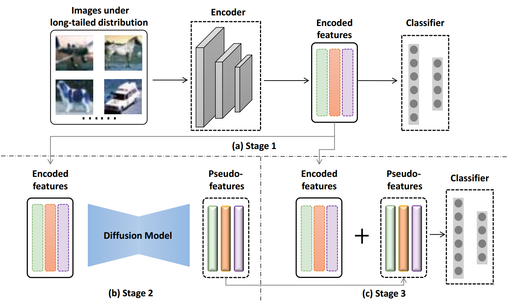

# LDMLR

The Pytorch implementation for the following paper (accpeted by L3D-IVU CVPR2024):

**"Latent-based Diffusion Model for Long-tailed Recognition"**

## Abstract
Long-tailed imbalance distribution is a common issue in practical computer vision applications. Previous works proposed methods to address this problem, which can be categorized into several classes: re-sampling, re-weighting, transfer learning, and feature augmentation. In recent years, diffusion models have shown an impressive generation ability in many sub-problems of deep computer vision. However, its powerful generation has not been explored in long-tailed problems. We propose a new approach, the Latent-based Diffusion Model for Long-tailed Recognition (LDMLR), as a feature augmentation method to tackle the issue. First, we encode the imbalanced dataset into features using the baseline model. Then, we train a Denoising Diffusion Implicit Model (DDIM) using these encoded features to generate pseudo-features. Finally, we train the classifier using the encoded and pseudo-features from the previous two steps. The model's accuracy shows an improvement on the CIFAR-LT and ImageNet-LT datasets by using the proposed method.

## Framework


<p align="center">
   
</p>

Overview of the proposed framework, LDMLR. The figure describes the training of the framework: (a) obtain encoded features by a pre-training convolutional neural network on the long-tailed training set, (b) Generate pseudo-features by the diffusion model using encoded features, and (c) Train the fully connected layers using encoded and pseudo-features. The encoder from (a) and the classifier from (c) are used to predict long-tailed data in the evaluation stage.


## Installation
- You must have an NVIDIA graphics card with at least 12GB (if ImageNet) VRAM and have [CUDA](https://developer.nvidia.com/cuda-downloads) installed.
- Install `Python >= 3.8` `PyTorch >= 1.12`.
- (Optional, Recommended) Create a virtual environment as follows:

```sh
git clone https://github.com/AlvinHan123/LDMLR
cd LDMLR

conda create -n LDMLR python=3.9
conda activate LDMLR

# install pytorch
pip install torch==1.13.1+cu116 torchvision==0.14.1+cu116 --extra-index-url https://download.pytorch.org/whl/cu116

# install dependencies
pip install -r requirements.txt
```

## Usage
### Dataset
Arrange files as following:
```plain
data
    imagenet
        imagenet_lt_test.txt
        imagenet_lt_train.txt
        imagenet_lt_val.txt
        ImageNet_val_preprocess.py
        imagenet_lt_test.txt
        train
            n01440764
            ....
        val
            ILSVRC2012_val_0000000001.JPEG
            ...
    CIFAR10_LT01
        airplane
            ariplane1.png
            ...
    CIFAR10_test
        airplane
            ariplane1.png
            ...
```

### Training
 ```
 python main.py --datapath your_datapath --model_fixed your_pretrained_resnet32_on_long_tailed
 ```

## Results
**CIFAR-LT.**
The encoder is ResNet-32. Classification accuracies in percentages are provided. "↑" indicates improvements over the baseline. The best numbers are in **bold**. The results of CE, Label Shift, and WCDAS are obtained by self-implemented networks.

| Method | CIFAR-10-LT IF=10 | CIFAR-10-LT IF=100 | CIFAR-100-LT IF=10 | CIFAR-100-LT IF=100 |
|--------|-------------------|--------------------|--------------------|---------------------|
| CE     | 88.22             | 72.46              | 58.70              | 41.28               |
| Label shift | 89.46        | 80.88              | 61.81              | 48.58               |
| WCDAS  | 92.48             | 84.67              | 65.92              | 50.95               |
| CE+LDMLR | 89.13 (↑0.91)   | 76.26 (↑3.80)      | 60.10 (↑1.40)      | 43.34 (↑2.06)       |
| Label shift+LDMLR | 89.70 (↑0.24) | 82.77 (↑1.89) | 62.67 (↑0.86)    | 49.76 (↑1.18)       |
| WCDAS+LDMLR | **92.58 (↑0.10)** | **86.29 (↑1.62)** | **66.32 (↑0.40)** | **51.92 (↑0.97)** |

**ImageNet-LT.**
The encoder is ResNet-10. The classification accuracies in percentages are provided. "↑" indicates the improvements over the baseline. The best numbers are in **bold**.

| Method                 | ImageNet-LT Many | ImageNet-LT Medium | ImageNet-LT Few | ImageNet-LT All |
|------------------------|------------------|--------------------|-----------------|-----------------|
| CE                     | 57.7             | 26.6               | 4.4             | 35.8            |
| Label shift            | 52.0             | 39.3               | 20.3            | 41.7            |
| WCDAS                  | 57.1             | 40.9               | 23.3            | 44.6            |
| CE+LDMLR               | 57.2             | 29.2               | 7.3             | 37.2 ↑1.4       |
| Label shift+LDMLR      | 50.9             | 39.4               | 23.7            | 42.2 ↑0.5       |
| **WCDAS+LDMLR**        | **57.0**         | **41.2**           | **23.4**        | **44.8 ↑0.2**   |

*code reference*
[WCDAS](https://github.com/boranhan/wcdas_code), [LT-baseline](https://github.com/ChangkunYe/MAPLS/), [denoising-diffusion-pytorch](https://github.com/lucidrains/denoising-diffusion-pytorch/tree/main/denoising_diffusion_pytorch).


## Paper and Citation  
If you find our paper/code is useful, please cite:
```
@article{han2024latent,
  title={Latent-based Diffusion Model for Long-tailed Recognition},
  author={Han, Pengxiao and Ye, Changkun and Zhou, Jieming and Zhang, Jing and Hong, Jie and Li, Xuesong},
  journal={arXiv preprint arXiv:2404.04517},
  year={2024}
}
```
